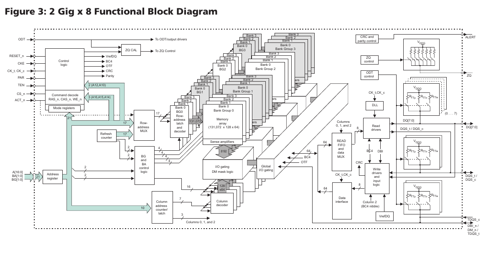
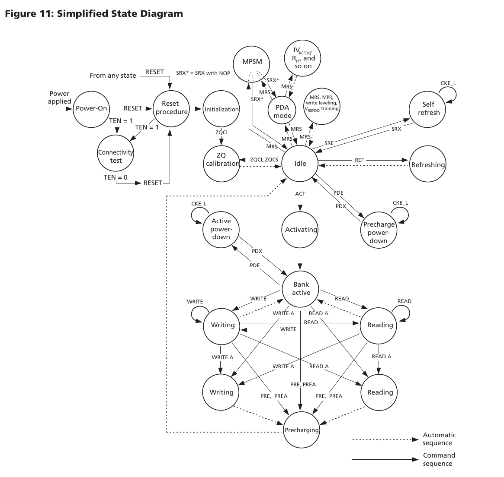

# MT40A2G8 DDR4 Functional Block Diagram Note

本文根据 Micron `MT40A2G8VA-062E` datasheet 中的 `2 Gig x 8 Functional Block Diagram` 整理，用来理解 DDR4 x8 颗粒内部结构，以及这些结构如何对应到控制器中的 stall、latency、FIFO 压力。



## 1. 整体结构

这颗器件是 `2G x 8` 组织方式：

- `2G`：共有约 2G 个 x8 数据位置，也就是 16Gb 容量。
- `x8`：外部数据总线为 `DQ[7:0]`，一次外部数据节拍传 8 bit。
- 内部有 4 个 bank group，每个 bank group 有 4 个 bank，共 16 个 bank。
- DDR4 是 8n prefetch 架构，内部一次列访问会取出更宽的数据，再通过 I/O 逻辑按 DDR 节拍输出。

可以把整颗 DDR4 看成五层：

1. 命令/地址输入层：接收 `CS_n/ACT_n/RAS_n/CAS_n/WE_n/A/BA/BG`。
2. 地址译码层：把地址拆成 row、bank group、bank、column。
3. 存储阵列层：真正保存数据的 memory array、sense amplifier。
4. 数据通路层：read FIFO、write driver、global I/O、DQ/DQS。
5. 辅助控制层：refresh、ZQ calibration、ODT、CRC/parity、DLL、ALERT。

## 2. 命令与地址路径

左侧是 DDR4 的命令和地址入口：

- `CK_t/CK_c`：差分时钟。
- `CKE`：clock enable，用于进入/退出低功耗状态。
- `CS_n`：片选。
- `ACT_n`：DDR4 新增的 activate 命令控制信号。
- `RAS_n/CAS_n/WE_n`：和 `ACT_n` 一起编码具体命令。
- `A[16:0]`：行地址、列地址、模式寄存器地址复用总线。
- `BA[1:0]`：bank address。
- `BG[1:0]`：bank group address。
- `RESET_n`：复位。

这些信号先进入 `Command decode` 和 `Address register`。

`Command decode` 的作用是识别当前周期命令，例如：

- ACTIVATE
- READ
- WRITE
- PRECHARGE
- REFRESH
- MODE REGISTER SET
- ZQ calibration

`Address register` 会锁存地址信号。因为 DDR 命令不是每个命令都用同一种地址格式，所以同一组 `A[16:0]` 在不同命令下含义不同：

- ACTIVATE 时，多数地址位是 row address。
- READ/WRITE 时，部分地址位是 column address。
- MRS 时，地址位表示模式寄存器配置值。

## 3. Row / Bank / Column 选择

中间偏左有三个关键模块：

- `Row-address MUX`
- `BG and BA control logic`
- `Column address counter/latch`

它们共同决定这次访问落到哪个位置：

```text
BG[1:0]  -> 选择 bank group
BA[1:0]  -> 选择 bank
Row addr -> 选择该 bank 内的一行
Col addr -> 选择该行内的一列
```

DDR4 的访问不是直接按线性地址读取。真实访问流程通常是：

1. ACTIVATE：打开某个 bank 中的一行。
2. 等待 `tRCD`。
3. READ/WRITE：访问打开行中的某个列。
4. 必要时 PRECHARGE：关闭当前行。
5. 等待 `tRP` 后才能打开另一行。

所以 `tRCD`、`tRP`、row hit、row miss、bank conflict 都来自这一层结构。

## 4. Bank Group 与 Bank 阵列

图中央的大堆叠就是 4 个 bank group：

```text
Bank Group 0: Bank 0, 1, 2, 3
Bank Group 1: Bank 0, 1, 2, 3
Bank Group 2: Bank 0, 1, 2, 3
Bank Group 3: Bank 0, 1, 2, 3
```

每个 bank 可以理解为一个相对独立的二维存储阵列。图中每个 bank 里都有：

- `Memory array`
- `Row-address latch and decoder`
- `Sense amplifiers`
- `I/O gating`
- `DM mask logic`

`Sense amplifiers` 很重要。DRAM 单元本身很小，只能存很弱的电荷。读一行时，整行数据先被 sense amplifier 放大并暂存。后续列访问是在这个已经打开的 row buffer 上进行。

因此：

- 如果下一次访问同一 bank 的同一行，就是 row hit，效率高。
- 如果访问同一 bank 的另一行，需要 precharge + activate，效率低。
- 如果访问不同 bank，控制器可以穿插调度，提高吞吐。
- 如果访问不同 bank group，某些列命令间隔可以更短。

## 5. Cell 选择机制与高效访问顺序

DDR 不是直接用一个线性地址选中孤立的 bit cell。控制器会先把地址拆成 `BG/BA/ROW/COL`：

```text
BG  -> Bank Group
BA  -> Bank Address
ROW -> Row Address
COL -> Column Address
```

一次真实访问通常先用 `BG/BA` 选中具体 bank，再通过 `ACTIVATE` 打开该 bank 中的一整行。被打开的 row 会进入 `sense amplifier`，形成当前 bank 的 `row buffer`。之后 `READ/WRITE` 命令再用 column 地址，从这条已经打开的 row 中选择一段 burst 数据。

最高效率来自 row hit：打开一行后尽量连续访问该 row 内的 column。更实用的访问直觉是：

```text
column inner loop
bank / bank group interleave
row outer loop
```

也就是优先让 column 连续滚动；需要隐藏等待时，在不同 bank 或 bank group 间交错；最后才切换 row。切换同一 bank 的不同 row 需要 `PRECHARGE + ACTIVATE`，会引入 `tRP + tRCD` 等额外等待。

实际 DDR 控制器不会机械地只按这个顺序发命令，因为还要避开几类硬件限制：

- `tCCD` 限制连续 column 命令之间的最小间隔。
- `tRRD` 限制连续 `ACTIVATE` 命令之间的最小间隔。
- `tFAW` 是滑动时间窗口，表示任意连续 `tFAW` 时间内最多允许 4 个 `ACTIVATE`，它限制开行密度，不表示不能连续读同一 row 的 column。
- 读写 turnaround 限制 DQ/DQS 总线方向切换，频繁读写交替会降低效率。
- refresh 到期时会强制插入刷新，使正常读写暂停一段时间。

所以，高效访问不是简单地永远读同一 row，而是在 row locality、bank 并行、读写方向、refresh 和 FIFO 水位之间做调度权衡。

## 6. Refresh Counter

图中左中部有 `Refresh counter`。

DRAM 数据靠电容保存，电荷会泄漏，所以必须周期刷新。refresh counter 用来产生或辅助选择要刷新的 row。

对控制器来说，refresh 会造成明显 stall：

```text
REFRESH issued
-> DDR 内部刷新
-> tRFC 时间内不能正常服务读写
```

对 `MT40A2G8VA-062E` 这类 16Gb DDR4，datasheet 中 `tRFC` 为数百 ns 量级。这会直接表现为 MIG `app_rdy=0`，也可能造成读数据返回空窗。

## 7. 读数据路径

读路径大致是：

```text
Memory array
-> Sense amplifiers
-> I/O gating
-> Global I/O gating
-> READ FIFO and data MUX
-> Read drivers
-> DQ[7:0] / DQS_t / DQS_c
```

图中可以看到内部有 `64` bit 宽的数据路径。这和 DDR4 的 8n prefetch 有关。虽然外部是 x8，但内部一次预取会拿到更宽的数据，再通过 DQ/DQS 按多个 DDR 节拍送出。

读操作的延迟主要来自：

- 行未打开时的 `ACTIVATE + tRCD`
- 列读命令到数据输出的 CAS latency
- bank group / command spacing
- read FIFO / data MUX / DLL / output driver
- refresh 或维护操作插入

在 native MIG 接口上，这些复杂因素最终表现为：

```text
app_rd_data_valid 不是每个周期都有
```

这就是 testbench 里 `read_gap_active`、`read_pending_full_active`、`read_pipe_stall` 想模拟的来源。

## 8. 写数据路径

写路径大致是：

```text
DQ[7:0] / DQS_t / DQS_c
-> Write drivers and input logic
-> Data interface
-> Global I/O gating
-> I/O gating / DM mask logic
-> Sense amplifiers / Memory array
```

写数据需要 DQS 对齐采样。`DM_n/DBI_n` 可以参与数据 mask 或 data bus inversion。

图中 `DM mask logic` 表示写入时可以按 byte lane 屏蔽部分数据。对于 x8 颗粒，外部就是一个 byte lane。

写路径中的 stall 主要来自：

- 写命令暂时不能被 DDR/MIG 接收。
- 写数据通道暂时不能接收。
- 写转读需要 bus turnaround。
- 同 bank row miss 或 bank group 限制导致调度延迟。

在 native MIG 接口上常表现为：

```text
app_rdy     = 0  -> 命令暂时不能收
app_wdf_rdy = 0  -> 写数据暂时不能收
```

## 9. DLL、DQS 与 I/O Driver

右侧有 `DLL`、`Read drivers`、`Write drivers and input logic`。

DDR 是高速源同步接口：

- `DQ` 是 Data I/O，承载真实读写数据。
- `DQS` 是 Data Strobe，数据选通信号。
- 读时 DDR 颗粒同时输出 `DQ` 和 `DQS`。
- 写时控制器同时输出 `DQ` 和 `DQS`。

`DQS` 的关键作用是给接收端提供就近的数据采样参考。因为 DDR 速率很高，只靠全局时钟很难保证每一位 `DQ` 都落在安全采样窗口中，所以读写数据都会围绕 `DQS` 做相位对齐。

`DLL` 是 Delay-Locked Loop，用来产生和调整内部时钟相位。它帮助 DDR 颗粒把读数据和 `DQS` 按合适相位推出，也帮助控制器/PHY 建立满足采样窗口的读写时序。

这也是为什么真实 DDR 会有 calibration。MIG 初始化时需要训练读写延迟、`DQS` 相位、bit/byte lane 对齐、bitslip 等，训练完成后才拉高 `init_calib_complete`。如果这部分训练不正确，即使命令顺序正确，DQ 数据也可能因为采样相位错误而读错。

## 10. ODT 与 ZQ Calibration

右上角有：

- `ODT control`
- `ZQ control`
- `ZQ CAL`
- 片外 `ZQ` 引脚

`ODT` 是 on-die termination，片内终端电阻，用来改善高速信号完整性。

`ZQ calibration` 用来校准输出驱动强度和 ODT 电阻值。DDR4 芯片通过 ZQ 引脚外接参考电阻，再校准内部阻抗。

这些机制本身不会改变用户数据内容，但会影响何时可以可靠读写。控制器可能在初始化或运行过程中插入维护周期，所以在 mock 中可以用 `maint_active` 表示这类非业务停顿。

## 11. CRC、Parity 与 ALERT

右上角还有 `CRC and parity control`，以及 `ALERT` 引脚。

DDR4 支持命令/地址 parity、写 CRC 等可靠性机制。如果检测到错误，可以通过 ALERT 报告。

这类功能通常由 MIG 或 PHY 层处理，普通用户 RTL 很少直接操作。但在严谨系统里，ALERT 可能会触发错误处理或重新训练。

## 12. 关键缩写与英文全称

| 缩写/变量 | 英文全称 | 含义 |
| --- | --- | --- |
| `DQ` | Data I/O | DDR 数据输入输出引脚 |
| `DQS` | Data Strobe | 数据选通信号，用于对齐和采样 DQ |
| `DM` | Data Mask | 写数据 mask |
| `DBI` | Data Bus Inversion | 数据总线翻转，降低同时翻转噪声 |
| `ODT` | On-Die Termination | 片内终端电阻 |
| `ZQ` | Impedance Calibration Reference | 阻抗校准参考引脚/机制 |
| `DLL` | Delay-Locked Loop | 延迟锁定环，用于相位调整 |
| `CRC` | Cyclic Redundancy Check | 循环冗余校验 |
| `PAR` | Parity | 奇偶校验 |
| `ALERT` | Alert Output | 错误/告警输出 |
| `BG` | Bank Group | bank group 地址 |
| `BA` | Bank Address | bank 地址 |
| `ROW` | Row Address | 行地址 |
| `COL` | Column Address | 列地址 |
| `MRS` | Mode Register Set | 模式寄存器设置命令 |
| `ACT` | Activate | 打开某个 bank 的一行 |
| `PRE` | Precharge | 关闭当前打开行 |
| `REF` | Refresh | 刷新命令 |
| `tRCD` | RAS to CAS Delay | ACTIVATE 到 READ/WRITE 的等待时间 |
| `tRP` | Row Precharge Time | PRECHARGE 到下一次 ACTIVATE 的等待时间 |
| `tRFC` | Refresh Cycle Time | refresh 占用时间 |
| `tREFI` | Refresh Interval | refresh 平均间隔 |
| `tCCD` | Column-to-Column Delay | 连续列命令间隔 |
| `tRRD` | Row-to-Row Activate Delay | 连续 ACTIVATE 间隔 |
| `tFAW` | Four Activate Window | 任意滑动窗口内最多 4 次 ACTIVATE 的限制 |
| `tWTR` | Write-to-Read Delay | 写转读等待时间 |
| `tRTW` | Read-to-Write Delay | 读转写等待时间 |
| `CL` | CAS Latency | READ 命令到读数据输出的 CAS 延迟 |
| `CWL` | CAS Write Latency | WRITE 命令到写数据输入的 CAS 写延迟 |
| `app_rdy` | Application Ready | MIG native app 命令通道 ready |
| `app_wdf_rdy` | Application Write Data FIFO Ready | MIG native app 写数据通道 ready |
| `app_rd_data_valid` | Application Read Data Valid | MIG native app 读数据有效 |
| `read_pending_full_active` | Read Pending Queue Full Active | mock 中读事务 pending 队列满 |
| `cmd_queue_full_active` | Command Queue Full Active | mock 中命令队列满 |

## 13. DDR4 简化状态机



这张状态机图说明 DDR4 从上电到正常读写之间的主要状态。图中实线箭头是控制器发出的命令序列，虚线箭头是 DDR 内部自动完成的序列。

主初始化路径是：

```text
Power-On -> Reset procedure -> Initialization -> ZQ calibration -> Idle
```

正常访问路径是：

```text
Idle -> ACT -> Activating -> Bank active
Bank active -> READ/WRITE -> Reading/Writing
Reading/Writing -> PRE/PREA -> Precharging -> Idle
```

`Idle` 是正常命令调度的中心状态。`ACT` 打开某个 bank 的 row，进入 `Bank active` 后才能对该 row 做 `READ/WRITE`。如果要换 row，需要先 `PRECHARGE`，等待预充电完成后再回到 `Idle` 或重新 `ACT`。

维护和低功耗路径包括：

- `REF -> Refreshing`：刷新期间普通读写暂停。
- `SRE/SRX -> Self refresh`：进入/退出自刷新。
- `PDE/PDX -> Power-down`：进入/退出低功耗。
- `MRS/MPR/PDA`：模式寄存器、训练和单颗粒配置相关状态。

对代码和 fast mock 的意义：

| 状态机概念 | 代码/验证中的表现 |
| --- | --- |
| `ACT / Activating / Bank active` | row miss 或开行等待，可能表现为 `app_rdy` stall |
| `READ / Reading` | read latency 后才出现 `app_rd_data_valid` |
| `WRITE / Writing` | 写命令和写数据受 `app_rdy/app_wdf_rdy` 约束 |
| `PRE / Precharging` | 换 row 前的预充电等待 |
| `REF / Refreshing` | 对应 mock 的 `refresh_active` |
| 读写方向切换 | 对应 mock 的 `turnaround_active` |
| 配置、校准、训练 | 对应初始化过程、`init_calib_complete` 或 `maint_active` |

## 14. 和 fast mock stall 的对应关系

| mock stall | 图中来源 | 真实含义 |
| --- | --- | --- |
| `refresh_active` | `Refresh counter`、bank array | DDR 正在刷新，读写暂停 |
| `maint_active` | `ZQ CAL`、`DLL`、control logic | 校准、维护、训练类暂停 |
| `ready_stall_active` | command decode、row/bank/column timing | MIG 暂时不能接受新命令 |
| `read_gap_active` | read FIFO、read drivers、data MUX | 读数据返回不连续 |
| `turnaround_active` | DQ/DQS 双向 I/O | 读写方向切换需要空窗 |
| `cmd_queue_full_active` | 控制器调度队列，不在芯片图中直接画出 | MIG 内部命令堆积，不能再接收 |
| `read_pending_full_active` | 控制器读事务跟踪，不在芯片图中直接画出 | 已发读命令太多，返回还没消化 |
| `read_pipe_stall` | read data path | 数据已接近返回，但返回通道被阻塞 |

## 15. 对 FIFO 验证的启发

这张图说明 DDR4 不是简单 RAM。它有 bank、row、column、refresh、I/O driver、DLL、ODT、ZQ 等多层结构，因此读写服务天然是不连续的。

对写 FIFO，危险场景是：

- refresh 时间较长；
- command queue full；
- row miss 或 bank 冲突导致 `app_rdy=0`；
- 读转写 turnaround 阻塞写命令。

这些会导致写 FIFO drain 不及时，产生 overflow 风险。

对读 FIFO，危险场景是：

- refresh 或 maintenance 期间没有读数据返回；
- read latency 抖动变大；
- read pending queue 满，无法继续发新读；
- 写转读 turnaround 让读补充变慢。

这些会导致读 FIFO refill 不及时，产生业务读侧断流风险。

## 16. 一句话总结

这张框图的核心是：DDR4 内部不是一个线性 SRAM，而是由多 bank group、多 bank、row buffer、prefetch I/O、DLL、ODT、refresh 和校准逻辑组成的高速存储系统。MIG 把这些复杂时序隐藏成 `app_rdy/app_wdf_rdy/app_rd_data_valid`，而 fast mock 中的各种 stall 就是在用可控方式模拟这些隐藏时序对 FIFO 和仲裁器造成的压力。
