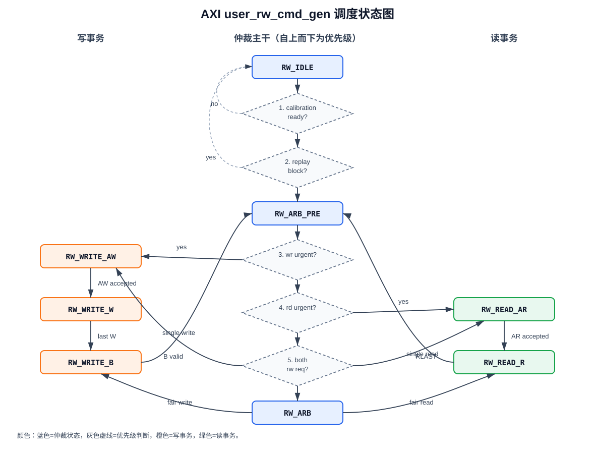
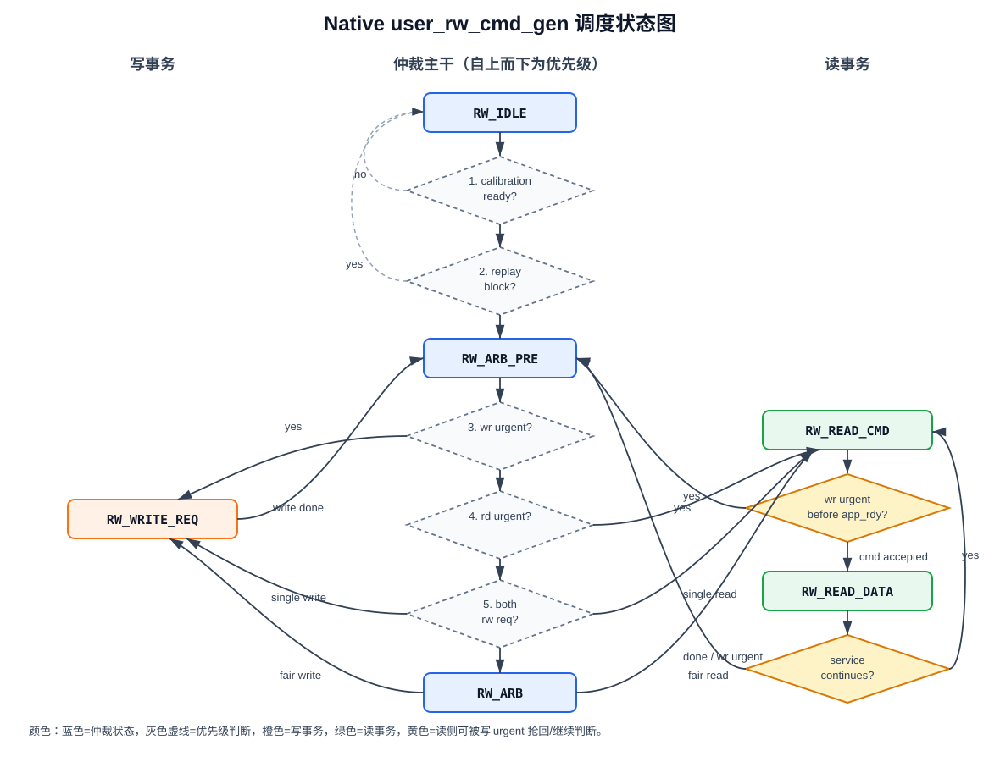

# `user_rw_cmd_gen` 调度机制说明

本文总结 `axi/rtl/user_rw_cmd_gen.sv` 和 `native/rtl/user_rw_cmd_gen.sv` 的读写调度机制。两版代码的核心目标相同：在 MIG `ui_clk` 域内，根据写 FIFO 压力、读 FIFO 水位、DDR 已写未读数据量和 replay/backtracking 状态，在写入 DDR 与从 DDR 预取读数据之间仲裁。

## 1. 共同调度骨架

两版 `user_rw_cmd_gen` 都运行在 `ui_clk` 域，输入来自两个方向：

- 写方向：系统侧写入的 128-bit 数据先进入写 FIFO，调度器从写 FIFO 取数据并写入 DDR。
- 读方向：调度器从 DDR 读取历史数据，写入读 FIFO，系统侧再通过 `user_r_rd_en` 拉取。

内部 DDR 地址都按 128-bit beat 计数，并使用一对环形指针：

- `user_ad_wr_i`：写入 DDR 的 beat 指针。
- `user_ad_rd_i`：从 DDR 读出的 beat 指针。
- `ddr_rd_empty = (user_ad_wr_i == user_ad_rd_i)`。
- `ddr_rd_avail_count = user_ad_wr_i - user_ad_rd_i`。

写数据真正被 MIG 接收时推进 `user_ad_wr_i`；读数据真正返回并写入读 FIFO 时推进 `user_ad_rd_i`。当 `rp_back_en` 有效时，读指针回退到 `{1'b0, rp_back_view_addr}`，用于 read replay / backtracking。

## 2. 水位与请求生成

两版使用相同的主要水位常量：

```systemverilog
WR_LEVEL_HIGH    = 8192
WR_LEVEL_URGENT  = 12288
RD_LEVEL_URGENT  = 4096
RD_LEVEL_LOW     = 8192
RD_LEVEL_HIGH    = 12288
RD_FIFO_DEPTH    = 16383
```

写侧压力判断：

- `wr_level_high`：写 FIFO 数据量达到 8192 beat，说明写侧压力偏高。
- `wr_level_urgent`：写 FIFO 数据量达到 12288 beat，说明写侧接近危险区，需要优先写。
- `wr_has_full_burst`：写 FIFO 至少有一组完整服务数据，来自 `~wr_fifo_prog_empty`。

读侧压力判断：

- `rd_level_urgent`：读 FIFO 接近空，或者数据量小于等于 4096 beat。
- `rd_level_low`：读 FIFO 数据量小于等于 8192 beat。
- `rd_fifo_can_prefetch`：读 FIFO 未满、未 prog_full，且水位低于 `RD_LEVEL_HIGH`，允许继续从 DDR 预取。

写请求 `ddr_wr_req` 在两种情况下产生：

```text
wr_fifo_valid && (wr_has_full_burst || wr_tail_age_reached)
```

`wr_tail_age_reached` 用来避免不满一组 burst 的尾部数据长期滞留。只要写 FIFO 有数据但一直不够完整 burst，等待达到 `WR_TAIL_AGE_LIMIT = 1024` 个 `ui_clk` 后也允许写出。

读请求 `ddr_rd_req_qual` 需要同时满足：

```text
DDR 内部已有可读数据
外部读请求经过 ui_clk 域延迟同步
读 FIFO 仍允许预取
```

对应代码含义是：

```systemverilog
(~ddr_rd_empty) & ddr_rd_req_dd & rd_fifo_can_prefetch
```

## 3. Replay 阻塞

两版都会在 `rp_back_en` 后设置 8-bit 延迟计数：

```systemverilog
block_for_replay = rp_back_en || (|rp_back_en_dly_cnt)
```

作用是：读指针回退期间不发起新的 DDR 事务，避免新读写和 replay 指针更新交叠。状态机在 `RW_IDLE` 或 `RW_ARB_PRE` 遇到 `block_for_replay` 时会回到或保持 `RW_IDLE`，直到 replay 阻塞窗口结束。

## 4. 仲裁策略

两版都采用两层仲裁：

1. `RW_ARB_PRE`：快速仲裁层，优先处理 urgent 或单边请求。
2. `RW_ARB`：公平仲裁层，当读写同时请求且没有 urgent 直接裁决时，按上一次公平授权方向交替。

请求会被打包成 `rw_req_t`：

```systemverilog
valid
urgent
high
low_or_urgent
len
```

预仲裁 `choose_pre_grant` 的优先级：

```text
1. 写 urgent -> 写
2. 读 urgent -> 读
3. 读写同时普通请求 -> 进入公平仲裁
4. 只有读请求 -> 读
5. 只有写请求 -> 写
```

公平仲裁 `choose_fair_grant` 的优先级：

```text
1. 写 urgent -> 写
2. 读 low/urgent -> 读
3. 写 high 且上次不是写 -> 写
4. 写 valid 且上次不是写 -> 写
5. 读 valid 且上次不是读 -> 读
6. 写 valid -> 写
7. 读 valid -> 读
```

`last_was_wr` / `last_was_rd` 只记录公平仲裁层的上一次方向。urgent 或单边授权会清掉这段历史，避免普通轮转状态污染紧急调度。

整体事务优先级可以概括为：

```text
最高优先级：复位 / MIG 未校准完成
次高优先级：replay/backtracking 阻塞窗口
紧急写：写 FIFO 到达 WR_LEVEL_URGENT
紧急读：读 FIFO 到达 RD_LEVEL_URGENT 或 almost_empty，且写不 urgent
普通公平仲裁：读写同时 valid 时按 last fair grant 交替
单边请求：只有读或只有写时直接服务
最低优先级：无请求，保持/回到仲裁入口
```

更细的授权顺序如下：

```text
1. ui_clk_sync_rst / rst_local_t_ddr_clk / make_data_on_edge / ~init_calib_complete
2. block_for_replay
3. wr_req.urgent
4. rd_req.urgent
5. both_rw_req -> RW_ARB
6. rd_req.valid
7. wr_req.valid
```

进入公平仲裁 `RW_ARB` 后：

```text
1. wr_req.urgent
2. rd_req.low_or_urgent
3. wr_req.high && !last_was_wr
4. wr_req.valid && !last_was_wr
5. rd_req.valid && !last_was_rd
6. wr_req.valid
7. rd_req.valid
```

## 5. AXI 版本调度流程

AXI 版本状态机为：

```text
RW_IDLE
RW_ARB_PRE
RW_ARB
RW_WRITE_AW
RW_WRITE_W
RW_WRITE_B
RW_READ_AR
RW_READ_R
```

AXI 状态转移图：



AXI 版事务边界的优先级特点：

- replay 阻塞只在新事务发起前生效，不会打断已经进入 `RW_WRITE_W`、`RW_WRITE_B` 或 `RW_READ_R` 的事务。
- 写事务一旦 AW 被接收，必须完整发送 W burst，并等待 B response 后才回到仲裁。
- 读事务一旦 AR 被接收，必须等到 RLAST 后才回到仲裁。
- `wr_level_urgent` 能优先获得下一次授权，但不能抢占已经被 AXI 接收的 burst。

写事务流程：

1. `RW_WRITE_AW` 发 AXI 写地址。
2. `m_axi_awvalid && m_axi_awready` 后进入 `RW_WRITE_W`。
3. `RW_WRITE_W` 连续发送 `write_burst_len` 个 W beat。
4. 最后一拍用 `m_axi_wlast` 标记。
5. `RW_WRITE_B` 等待 `m_axi_bvalid`，写响应返回后才重新仲裁。

读事务流程：

1. `RW_READ_AR` 发 AXI 读地址。
2. `m_axi_arvalid && m_axi_arready` 后进入 `RW_READ_R`。
3. `RW_READ_R` 接收 R beat，`m_axi_rready` 受 `rd_fifo_full` 限制。
4. `m_axi_rlast` 跟随最后一拍返回，`read_burst_done` 后重新仲裁。

AXI 版本每次授权对应一个 AXI INCR burst。完整写事务必须等到 B response，因此写服务粒度更像：

```text
AW handshake -> W burst -> B response -> re-arbitrate
```

完整读事务则是：

```text
AR handshake -> R burst with RLAST -> re-arbitrate
```

AXI 地址转换：

```systemverilog
beat_to_axi_addr = beat_addr << 4
```

原因是内部地址按 128-bit beat 计数，而 AXI 地址是 byte address；一个 128-bit beat 等于 16 Byte。

AXI 版本还限制 burst 不跨 4KB boundary：

```systemverilog
beats_to_4kb_boundary = 256 - beat_addr[7:0]
```

写 burst 长度取写 FIFO 可用数量和 4KB 边界限制的较小值。读 burst 长度取服务上限、读 FIFO 空间、4KB 边界限制和 DDR 可读数量的约束。

AXI 读服务上限：

- 正常最大 `RD_GRANT_MAX = 256` beat。
- 当 `wr_level_high` 有效时缩短为 `RD_GRANT_WR_HIGH = 128` beat，让写侧更快重新获得仲裁机会。

## 6. Native 版本调度流程

native 版本状态机为：

```text
RW_IDLE
RW_ARB_PRE
RW_ARB
RW_WRITE_REQ
RW_READ_CMD
RW_READ_DATA
```

Native 状态转移图：



Native 版事务边界的优先级特点：

- replay 阻塞只影响新命令发起，不会取消已经被 MIG 接收的读命令。
- 写侧 urgent 可以在 `RW_READ_CMD` 中抢回仲裁，但前提是读命令还没有被 `app_rdy` 接收。
- 一旦读命令通过 `app_en && app_rdy` 被接收，状态机会进入 `RW_READ_DATA` 等待返回数据；这笔 pending read 不能丢。
- `RW_READ_DATA` 收到一个 beat 后，如果写侧已经 urgent，会停止继续发后续读命令并回到仲裁。
- native 写服务按 beat 推进，命令通道 `app_rdy` 和写数据通道 `app_wdf_rdy` 都满足时，才算该写 beat 完成。

native MIG 端口没有 AXI 的 AW/W/B/AR/R 五通道，而是通过 `app_*` 直接发命令、写数据和收读数据。

写事务流程：

1. `RW_WRITE_REQ` 同时准备写命令和写数据。
2. `app_en && app_rdy` 表示命令被 MIG 接收。
3. `app_wdf_wren && app_wdf_rdy` 表示写数据被 MIG 接收。
4. 当前代码把 `write_data_fire` 定义为命令和写数据同拍都完成。
5. 每完成一个 native 写 beat，推进写指针和 `write_beat_cnt`。
6. 达到 `write_burst_len` 后回到仲裁。

native 写请求驱动重点：

```systemverilog
app_cmd      = APP_CMD_WRITE
app_en       = RW_WRITE_REQ && app_wdf_rdy && wr_fifo_valid
app_wdf_wren = RW_WRITE_REQ && app_rdy && wr_fifo_valid
app_wdf_end  = app_wdf_wren
```

也就是说，当前实现让命令通道和写数据通道尽量同拍握手；`app_wdf_end` 每个 beat 都置位，因为当前 native 口上每个 128-bit beat 都对应一次 app command。

读事务流程：

1. `RW_READ_CMD` 发一个 native 读命令。
2. `app_en && app_rdy` 后进入 `RW_READ_DATA`。
3. `RW_READ_DATA` 等待 `app_rd_data_valid`。
4. 读数据有效且读 FIFO 未满时写入读 FIFO，并推进读指针。
5. 如果本次服务还没达到 `read_burst_len`，回到 `RW_READ_CMD` 发下一条读命令。
6. 如果读服务完成，或写侧进入 urgent，回到仲裁。

native 读命令可以在尚未被 MIG 接收前被写 urgent 打断：

```text
RW_READ_CMD 中如果 wr_level_urgent 有效，回到 RW_ARB_PRE
```

但读命令一旦 `app_cmd_fire` 被 MIG 接收，就必须进入 `RW_READ_DATA` 等返回数据，不能丢掉 pending read。

native 地址转换：

```systemverilog
beat_to_app_addr = beat_addr << 3
```

原因是 native MIG `app_addr` 按 x16 memory interface word 计数；一个 128-bit beat 覆盖 8 个 x16 word。

native 读服务上限：

- 正常最大 `RD_SERVICE_MAX = 512` beat。
- 当 `wr_level_high` 有效时缩短为 `RD_SERVICE_WR_HIGH = 128` beat。

native 版本没有 AXI burst 的 4KB boundary 检查，因为 native app 接口不是 AXI byte-address burst 协议。它仍按内部 `read_burst_len` / `write_burst_len` 做成组服务，但实际在 app 端口上是逐 beat 命令。

## 7. 两版关键差异

| 项目 | AXI 版本 | Native 版本 |
| --- | --- | --- |
| MIG 用户口 | AXI4 `AW/W/B/AR/R` | native `app_*` |
| 写服务 | 一个 AXI burst，等待 B response | 每个 128-bit beat 一次 app 写命令/数据 |
| 读服务 | 一个 AXI burst，等待 RLAST | 多次 `READ_CMD -> READ_DATA` 循环 |
| 地址单位 | byte address，`beat << 4` | x16 word address，`beat << 3` |
| 4KB 边界 | 必须限制 AXI burst 不跨 4KB | 当前无 AXI 4KB burst 约束 |
| 写完成判断 | W 最后一拍后还要等 B response | 写命令和写数据同拍握手即完成该 beat |
| 读完成判断 | R beat + RLAST | `app_rd_data_valid` 计数达到服务长度 |
| 读服务上限 | 256 beat，写高压时 128 beat | 512 beat，写高压时 128 beat |
| backpressure 观察 | `awready/wready/bvalid/arready/rvalid` | `app_rdy/app_wdf_rdy/app_rd_data_valid` |

## 8. Warning / Overrun 机制

两版都用带额外 MSB 的环形指针判断 DDR 内部缓存距离：

- `set_ddr_overrun`：写指针追上读指针且 wrap bit 不同，说明环形空间被写满。
- `ddr_warning`：写读指针距离进入高位危险区，提前告警。

`fault_ddr_overrun` 和 `fault_ddr_warning` 可用于故障注入。复位、MIG calibration 未完成或 `make_data_on_edge` 时会清除告警。

## 9. Debug 计数器

两版末尾都有 ILA debug streak counter，用于统计某类等待连续持续了多少个 `ui_clk`，并记录最大值。

共同计数项：

- `dbg_wr_no_service`：有写请求但没有写数据真正进入 MIG。
- `dbg_rd_no_service`：有读请求但没有读数据真正进入读 FIFO。
- `dbg_replay_block`：replay/backtracking 正在阻塞新命令。

AXI 专有计数项：

- `dbg_aw_wait`：AW valid 等 AW ready。
- `dbg_w_wait`：W valid 等 W ready。
- `dbg_b_wait`：B ready 等 B valid。
- `dbg_ar_wait`：AR valid 等 AR ready。
- `dbg_r_data_wait`：进入读数据状态后等待 R valid。

Native 专有计数项：

- `dbg_wr_app_rdy_wait`：写状态中 WDF ready 已有，但命令通道 `app_rdy` 未到。
- `dbg_wr_wdf_rdy_wait`：写状态中等待 `app_wdf_rdy`。
- `dbg_rd_cmd_wait`：读命令等待 `app_rdy`。
- `dbg_rd_data_wait`：读命令已发出后等待 `app_rd_data_valid`。

这些计数器适合配合 ILA 判断压力来自哪里：是写 FIFO 没被 drain、读数据不返回、MIG ready 长时间拉低，还是 replay 阻塞窗口过长。

## 10. 调度直觉总结

可以把整个调度器理解成下面的优先级系统：

```text
1. MIG 未校准完成或本地复位 -> 不发命令
2. replay/backtracking 正在回退读指针 -> 暂停新命令
3. 写 FIFO urgent -> 强制优先写，防 overflow
4. 读 FIFO urgent/low -> 在写不 urgent 时优先补读
5. 写 FIFO high -> 缩短读服务窗口，让写侧更快回来
6. 普通读写同时存在 -> 根据 last fair grant 交替
7. 单边请求 -> 直接服务该方向
```

AXI 版本的调度边界是完整 AXI transaction；native 版本的调度边界更细，按 native app beat 和 read-return 循环推进。两版都尽量保证当前已接受的事务完整结束后再重新仲裁，避免 ready/backpressure 下地址、计数器或 FIFO 读写提前移动。
