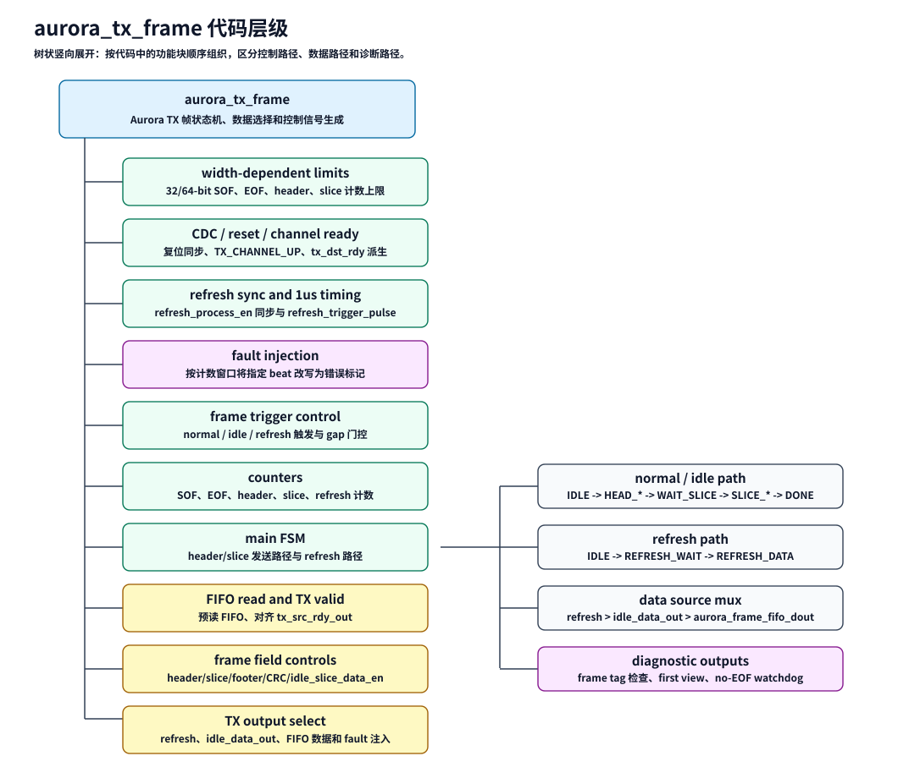

# AURORA_TX_FRAME_DESCRIPTION

## 1. 总体功能

`aurora_tx_frame` 是 `ddr_cache` 工程中 Aurora TX 侧的帧发送控制核心。它接收 DDR FIFO 数据、idle frame 数据和 refresh 请求，在 `gtx_user_clk_in` 时钟域内选择发送 normal、idle 或 refresh frame，并通过 AXI4-Stream master 接口输出数据。

外部接口只使用标准 AXI4-Stream 信号：`m_axis_tx_tdata`、`m_axis_tx_tvalid`、`m_axis_tx_tready`、`m_axis_tx_tlast`、`m_axis_tx_tkeep`。模块不导出 `TUSER`，SOF 只作为内部帧边界信号 `axis_frame_sof` 使用。对下游而言，reset 后或上一个 `TLAST` handshake 后的第一个 `TVALID && TREADY` beat 就是 packet 起点。

## 2. 代码层级



| 层级 | 逻辑块 | 主要职责 |
| --- | --- | --- |
| 顶层模块 | `aurora_tx_frame` | 组织 normal、idle、refresh 发送并输出 AXI4-Stream TX 信号 |
| 宽度参数 | width-dependent limits | 根据 `TX_DATA_WIDTH_32` 设置 SOF/EOF/header/slice 计数上限 |
| 同步复位 | CDC / reset / channel up | 同步 reset、channel up、refresh 和 1us tick |
| 触发控制 | frame trigger control | 产生 normal/idle/refresh frame 请求并控制帧间节奏 |
| 计数器 | counters | 统计 SOF、EOF、header、slice、refresh 和 slice 间隔 |
| 主状态机 | main FSM | 控制 header frame、slice frame 和 refresh frame 状态跳转 |
| FIFO/valid | FIFO read and AXIS valid | 预读 FIFO，并对齐 `axis_frame_valid` |
| 帧字段控制 | frame field controls | 输出 header/slice/footer/CRC/idle 控制信号 |
| 数据选择 | AXIS output select | 选择 refresh、idle 或 FIFO 数据输出到 `m_axis_tx_tdata` |
| 诊断 | diagnostic outputs | 检查 frame tag、first view 和 no-EOF watchdog |

## 3. AXI4-Stream 边界

`aurora_tx_frame` 的发送推进条件是：

```systemverilog
assign axis_tx_fire = m_axis_tx_tready & tx_channel_up_gtx_d3;
```

`axis_tx_fire` 表示 AXI4-Stream sink ready 且 Aurora channel up。状态机计数、FIFO 读使能、CRC 使能、header/slice/footer 控制信号都只在 `axis_tx_fire` 有效时推进。

AXI4-Stream 输出控制为：

```systemverilog
assign m_axis_tx_tkeep  = '1;
assign axis_frame_sof   = frame_sof | refresh_frame_sof;
assign m_axis_tx_tlast  = frame_eof | refresh_frame_eof;
assign m_axis_tx_tvalid = axis_frame_valid | refresh_axis_valid;
```

`axis_frame_sof` 是内部 frame 起点标记，只供 CRC 清零和诊断使用，不是外部 AXI4-Stream 端口。

所有输出 beat 都是完整字节有效：

- 32-bit 模式：`m_axis_tx_tkeep[3:0] = 4'hf`
- 64-bit 模式：`m_axis_tx_tkeep[7:0] = 8'hff`

## 4. 帧状态机

状态机包括 header、slice、refresh 三类路径。状态名称仍保留 SOF/EOF，因为它们描述的是内部帧结构，而不是外部旧式接口。

| 状态 | 功能 |
| --- | --- |
| `IDLE` | 等待 normal、idle 或 refresh 触发 |
| `HEAD_SOF_PRE_STA` / `HEAD_SOF_PRE_STA2` | 预读 header FIFO 数据并对齐输出延迟 |
| `HEAD_SOF_STA` | 发送 header frame 的起始 beat，并产生 `frame_sof` |
| `HEAD_DATA_STA` | 发送 header payload |
| `HEAD_EOF_STA` | 发送 header frame 尾部，并产生 `frame_eof` |
| `WAIT_SLICE_STA` | 等待 slice 发送条件 |
| `SLICE_SOF_PRE_STA` / `SLICE_SOF_PRE_STA2` | 预读 slice FIFO 数据并对齐输出延迟 |
| `SLICE_SOF_STA` | 发送 slice frame 的起始 beat，并产生 `frame_sof` |
| `SLICE_DATA_STA` | 发送 slice payload |
| `SLICE_EOF_STA` | 发送 slice frame 尾部，并产生 `frame_eof` |
| `SLICE_DONE_STA` | 当前 view 发送完成 |
| `REFRESH_WAIT` | 等待 refresh tick |
| `REFRESH_DATA` | 发送 refresh 控制 frame |

## 5. normal / idle / refresh 数据路径

normal frame 读取 `aurora_frame_fifo_dout`，idle frame 使用 `idle_data_out`，refresh frame 在 `aurora_tx_frame` 内部生成固定控制字。

数据选择优先级为：

```systemverilog
axis_tdata_pre_fault = refresh_frame_sof ? refresh_sof_word :
                       refresh_frame_eof ? refresh_eof_word :
                       idle_frame_ind ? idle_data_out :
                       aurora_frame_fifo_dout;
```

若 fault injection 命中，输出数据会在进入 `m_axis_tx_tdata` 前被替换高位错误标记，用于触发诊断链路。

## 6. FIFO 和 backpressure

FIFO 读使能只在 `axis_tx_fire` 时产生，因此 `m_axis_tx_tready=0` 时不会继续读 DDR FIFO。`axis_frame_valid` 由 FIFO 输出延迟对齐后产生：

```systemverilog
assign axis_frame_valid = fifo_rd_en_dly & tx_channel_up_gtx_d3;
```

这使 `TVALID/TLAST/TDATA` 在 backpressure 期间保持当前 beat，直到下游重新 ready 并完成 handshake。

## 7. CRC 和诊断

CRC 检查使用 `m_axis_tx_tvalid`、`m_axis_tx_tready`、`m_axis_tx_tlast` 和内部 `axis_frame_sof`。CRC 数据只在 `TVALID && TREADY` 时推进，`axis_frame_sof` 的 handshake beat 清 CRC。

header/data tag 检查继续使用内部 SOF 状态点：

- `head_sof = axis_tx_fire & (auro_frame_state == HEAD_SOF_STA)`
- `data_sof = axis_tx_fire & (auro_frame_state == SLICE_SOF_STA)`

no-EOF watchdog 使用内部 `frame_eof` 判断发送过程是否长期没有走到 frame 尾部。

## 8. 关键命名约定

- `axis_*`：AXI4-Stream handshake、valid、data 或内部 AXIS 相关桥接信号。
- `frame_*`：内部 frame 边界信号，例如 `frame_sof` / `frame_eof`。
- `refresh_frame_*`：refresh frame 的内部边界信号。
- `refresh_axis_valid`：refresh 数据路径贡献的 AXI4-Stream valid。
- `axis_tdata_pre_fault`：fault injection 前的已选输出数据。

这些命名用于避免把内部 SOF 误表达成 AXI4-Stream 标准端口；外部 packet 起点仍由 AXI4-Stream packet 规则隐式识别。