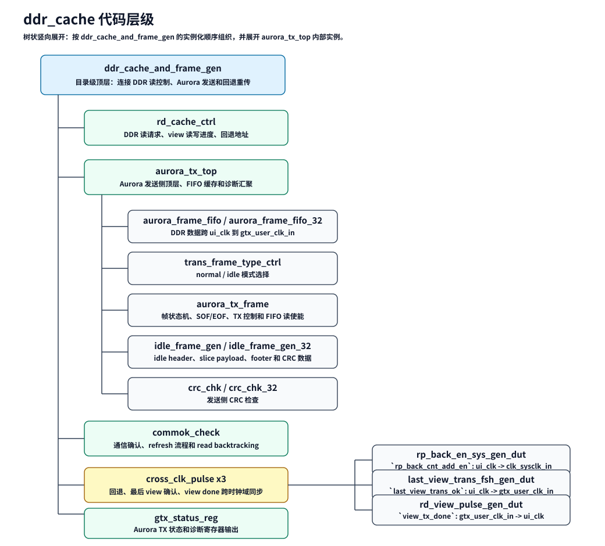

# DDR_CACHE_MODULE_DESCRIPTION

## 1. 总体功能

`ddr_cache` 是独立的 DDR 读缓存和 Aurora TX frame 发送工程。它从 DDR 读侧组织 view 数据，经 FIFO 跨到 GTX 用户时钟域，再由 `aurora_tx_frame` 组成 normal、idle 或 refresh frame，通过 AXI4-Stream master 接口输出到下游 Aurora TX 路径。

工程的外部 TX 边界已经改为 AXI4-Stream：

- `m_axis_tx_tdata`
- `m_axis_tx_tvalid`
- `m_axis_tx_tready`
- `m_axis_tx_tlast`
- `m_axis_tx_tkeep`

不导出 SOF 或 `TUSER`。packet 起点按 AXI4-Stream 规则隐式识别：reset 后或上一个 `TLAST` handshake 后的第一个 `TVALID && TREADY` beat 是新 packet 的第一个 beat。

## 2. 主要模块

| 模块 | 功能 |
| --- | --- |
| `ddr_cache_and_frame_gen` | ddr_cache 独立工程顶层，连接 DDR 读控制、Aurora TX top 和 AXI4-Stream 输出 |
| `rd_cache_ctrl` | DDR 读 view 控制、读地址/长度管理、回退重传相关控制 |
| `aurora_tx_top` | GTX 侧发送子系统顶层，连接 FIFO、frame 生成、idle frame、CRC 检查和诊断 |
| `aurora_tx_frame` | TX frame 状态机，选择 normal/idle/refresh 数据并驱动 AXI4-Stream 输出 |
| `idle_frame_gen` | 生成 idle header/slice/footer 数据 |
| `crc_chk` / `crc_chk_32` | 按 AXI4-Stream handshake 检查发送帧尾 CRC |

## 3. 数据流



基本路径如下：

```text
DDR read data
  -> aurora_frame_fifo
  -> aurora_tx_frame
  -> m_axis_tx_tdata/tvalid/tready/tlast/tkeep
```

normal view 数据来自 DDR FIFO。idle frame 不读取 DDR FIFO，由 `idle_frame_gen` 生成固定结构数据。refresh frame 优先级最高，由 `aurora_tx_frame` 内部生成固定控制字并通过同一 AXI4-Stream 输出。

## 4. AXI4-Stream 输出接口

| 信号 | 方向 | 说明 |
| --- | --- | --- |
| `m_axis_tx_tdata` | output | 发送数据，32-bit 或 64-bit 由 `TX_DATA_WIDTH_32` 决定 |
| `m_axis_tx_tvalid` | output | 当前 beat 有效 |
| `m_axis_tx_tready` | input | 下游 ready |
| `m_axis_tx_tlast` | output | 当前 packet 最后一个 beat |
| `m_axis_tx_tkeep` | output | 字节有效掩码，所有 beat 恒为全 1 |

32-bit 模式下 `tkeep=4'hf`，64-bit 模式下 `tkeep=8'hff`。

内部 handshake 使用：

```systemverilog
axis_tx_fire = m_axis_tx_tready & tx_channel_up_gtx_d3;
```

状态机计数、FIFO 读使能、CRC 累加、诊断采样都以 `axis_tx_fire` 为推进条件。

## 5. 帧边界

SOF/EOF 在工程内部仍然表示 frame 结构，但不再作为外部接口导出。

```systemverilog
assign frame_sof = (sof_cnt == 'h0) &
                   ((auro_frame_state == HEAD_SOF_STA) |
                    (auro_frame_state == SLICE_SOF_STA));

assign frame_eof = eof_cnt_rch &
                   ((auro_frame_state == HEAD_EOF_STA) |
                    (auro_frame_state == SLICE_EOF_STA));
```

外部 frame 尾部映射到 `m_axis_tx_tlast`：

```systemverilog
assign axis_frame_sof   = frame_sof | refresh_frame_sof;
assign m_axis_tx_tlast  = frame_eof | refresh_frame_eof;
assign m_axis_tx_tvalid = axis_frame_valid | refresh_axis_valid;
```

`axis_frame_sof` 只是内部桥接信号，用于 CRC 清零和诊断，不是 public `TUSER`。

## 6. normal / idle / refresh 行为

normal view：

- 从 DDR FIFO 读取 payload。
- `TVALID && TREADY` 时状态机和计数器推进。
- header 和 slice frame 的最后一个 beat 拉高 `m_axis_tx_tlast`。

idle frame：

- 不读 DDR FIFO。
- 使用 `idle_frame_gen` 提供的 `idle_data_out`。
- 仍通过 AXI4-Stream 输出完整 packet，并在尾 beat 拉高 `m_axis_tx_tlast`。

refresh frame：

- 优先于 normal/idle。
- 由 `refresh_frame_sof` / `refresh_frame_eof` 标记内部边界。
- `refresh_axis_valid` 参与生成外部 `m_axis_tx_tvalid`。

## 7. CRC 和诊断

CRC 检查模块接收 AXI4-Stream 命名端口：

```systemverilog
.axis_frame_sof   (axis_frame_sof),
.m_axis_tx_tlast  (m_axis_tx_tlast),
.m_axis_tx_tvalid (m_axis_tx_tvalid),
.m_axis_tx_tready (m_axis_tx_tready),
.m_axis_tx_tdata  (m_axis_tx_tdata)
```

CRC 只在 `TVALID && TREADY` 时推进；`axis_frame_sof` 的 handshake beat 清 CRC；`m_axis_tx_tlast` 的 handshake beat 捕获并比较 frame 尾部 CRC。

诊断保留原功能：

- header/data tag 检查继续使用内部 SOF 状态点。
- first-view 标记继续从 header payload 指定位提取。
- no-EOF watchdog 继续监控长时间没有 `frame_eof` 的异常。

## 8. 命名清理结果

`ddr_cache/` 中公开接口不再使用 旧式 `tx_*_n` 信号。`aurora_tx_frame` 内部临时信号使用 mixed `axis_*` / `frame_*` 命名：

- `axis_tx_fire`：AXI4-Stream sink ready 且 channel up。
- `axis_frame_valid`：normal 数据路径贡献的 AXI4-Stream valid。
- `frame_sof` / `frame_eof`：normal frame 内部边界。
- `refresh_frame_sof` / `refresh_frame_eof`：refresh frame 内部边界。
- `refresh_axis_valid`：refresh 数据路径贡献的 AXI4-Stream valid。
- `axis_tdata_pre_fault`：fault injection 前的已选输出数据。

状态名中的 `HEAD_SOF_STA`、`SLICE_EOF_STA` 等仍保留，因为它们描述 frame 内部结构，不是外部接口信号。