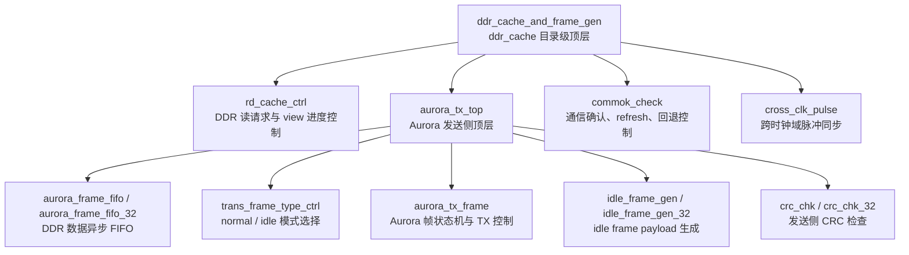
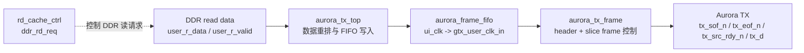
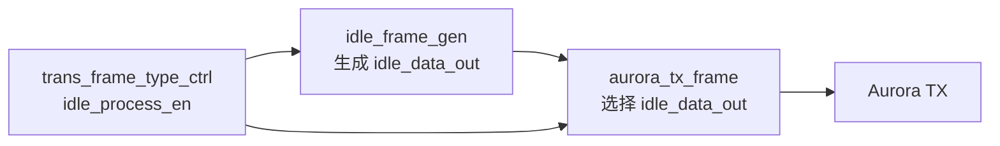
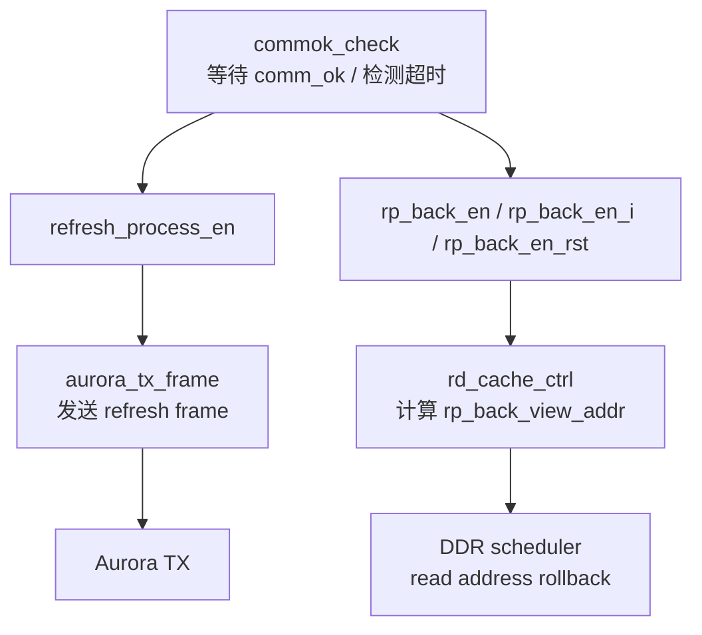
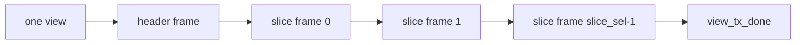
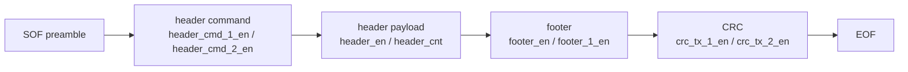
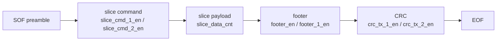
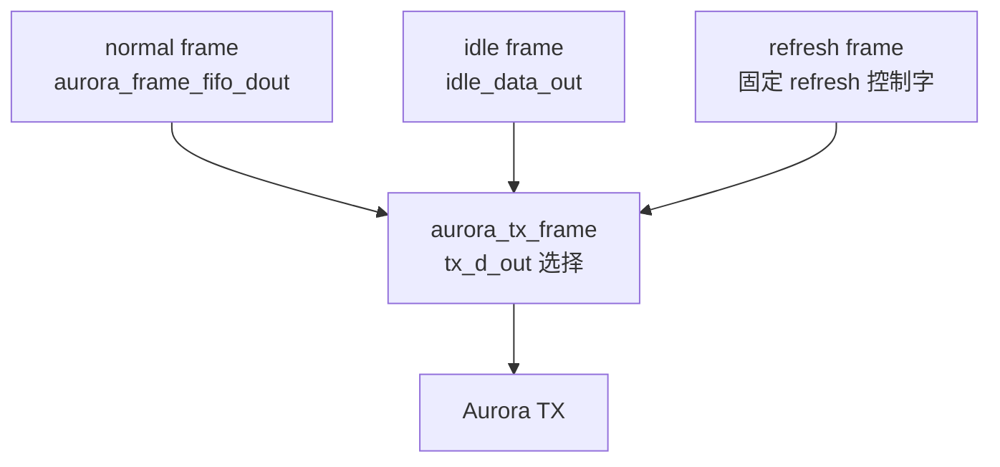
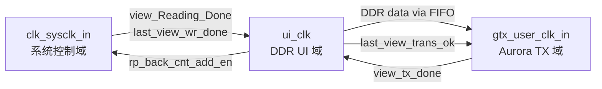

# ddr_cache 模块说明

## 1. 总体功能

`ddr_cache` 是 DDR 调度器下一级的缓存读取与 Aurora 发送模块。它从 DDR 读通道接收 `user_r_data/user_r_valid`，按 view 粒度缓存到 Aurora 发送 FIFO，再由 Aurora TX 帧生成逻辑组织为 header frame、slice frame、idle frame 或 refresh frame，最终输出 Aurora LocalLink 风格的 `tx_*` 接口。

该模块同时负责：

- 根据写入 view 数和读出 view 数控制 DDR 读请求。
- 在 Aurora 侧发送每个 view 的 header frame 与多个 slice frame。
- 在无有效采集数据或链路等待期间发送 idle frame。
- 根据通信确认 `comm_ok` 判断 view 是否发送成功。
- 通信异常时触发 refresh 流程和 DDR read backtracking。
- 生成和检查 CRC，并输出 Aurora 发送诊断状态。

## 2. 代码层级

当前 `ddr_cache` 目录的主要层级如下：

其中 `ddr_cache_and_frame_gen.sv` 是目录级顶层，连接 DDR UI 时钟域、GTX/Aurora 时钟域、系统控制时钟域，以及外部 DDR 调度器和 Aurora TX 接口。

| 层级 | 模块 | 主要职责 |
| --- | --- | --- |
| 目录级顶层 | `ddr_cache_and_frame_gen` | 连接 DDR 读控制、Aurora 发送、通信确认和回退重传 |
| DDR 读控制 | `rd_cache_ctrl` | 产生 DDR 读请求，统计 view 读写进度，计算回退地址 |
| Aurora 发送顶层 | `aurora_tx_top` | FIFO 缓存、帧发送、idle 数据、CRC 检查和诊断汇聚 |
| 帧控制核心 | `aurora_tx_frame` | 组织 header/slice/idle/refresh frame 并输出 `tx_*` |
| idle 数据 | `idle_frame_gen` | 生成 idle frame 的 header、slice、footer、CRC 数据 |
| 通信确认 | `commok_check` | 根据 `comm_ok` 判断发送是否成功，触发 refresh 和回退 |

## 3. 顶层模块

### 3.1 `ddr_cache_and_frame_gen.sv`

`ddr_cache_and_frame_gen` 是 `ddr_cache` 的总顶层，负责把 DDR 读控制、Aurora 帧发送、通信确认和回退重传控制串起来。

主要功能：

- 接收 DDR 读数据 `user_r_data/user_r_valid`，交给 `aurora_tx_top` 缓存和发送。
- 通过 `rd_cache_ctrl` 产生 `ddr_rd_req` 和 `req_stop`，控制上一级 DDR 调度器是否继续读数据。
- 通过 `commok_check` 检测每个 view 发送后的通信确认结果。
- 在通信异常时输出 `rp_back_en`、`rp_back_view_addr`，通知 DDR 读地址回退。
- 将 `view_tx_done`、`last_view_trans_ok`、`rp_back_cnt_add_en` 等跨时钟域控制信号通过 `cross_clk_pulse` 同步到目标时钟域。
- 输出 `cache_tp`、`rd_cache_state`、`rd_wr_num_equ`、`auro_tx_status_reg_out` 等调试和状态信号。

### 3.2 `aurora_tx_top.sv`

`aurora_tx_top` 是 Aurora 发送侧顶层，工作在 DDR UI 时钟域和 GTX 用户时钟域之间。

主要功能：

- 将 DDR 输出的 128-bit `user_r_data` 按 32-bit 或 64-bit Aurora 数据宽度重排后写入异步 FIFO。
- 例化 `aurora_frame_fifo` 或 `aurora_frame_fifo_32`，完成 `ui_clk` 到 `gtx_user_clk_in` 的数据跨域缓存。
- 根据 `slice_length_odd/even` 设置 FIFO `prog_empty_thresh`，用于判断一段 slice 数据是否足够发送。
- 管理 Aurora TX 本地复位，包括 `make_data_on` 上升沿、回退重传复位 `rp_back_en_rst` 和 Aurora reset。
- 例化 `trans_frame_type_ctrl` 判断当前应发送 normal frame 还是 idle frame。
- 例化 `aurora_tx_frame` 产生 Aurora 的 SOF/EOF/SRC_RDY、FIFO 读使能和帧控制信号。
- 例化 `idle_frame_gen` 生成 idle frame 的实际 payload。
- 例化 `crc_chk` 对发送出的 Aurora 数据进行 CRC 检查。
- 检测 FIFO overflow/underflow 并输出诊断脉冲。

## 4. 子模块功能

### 4.1 `rd_cache_ctrl.sv`

`rd_cache_ctrl` 负责 DDR 读请求调度和 view 级读写进度管理，是 DDR 调度器与 Aurora 发送缓存之间的读控制模块。

主要功能：

- 将系统时钟域的 `view_Reading_Done`、`last_view_wr_done` 同步到 `ui_clk`。
- 维护 `wr_view_num` 和 `rd_view_num`，判断是否存在“已写入但未读出”的 view。
- 当 `wr_view_num > rd_view_num`、Aurora FIFO 未满、非 idle、非 refresh 且链路正常时，允许发起 DDR 读请求。
- 用三段式状态机控制 `ddr_rd_req`，并在两个 view 之间插入约 90 us 的读间隔。
- 根据 `view_size` 和 `user_r_valid` 统计单个 view 的 DDR 返回数据数量，产生 `sample_frame_rd_done`。
- 支持最多两个 view 的 read backtracking，计算 `rp_back_view_addr` 供上一级 DDR 读地址回退。
- 当最后一个写入 view 已读完、发送成功且 DDR 读 FIFO 为空时，输出 `last_view_trans_ok`。

### 4.2 `aurora_tx_frame.sv`

`aurora_tx_frame` 是 Aurora 发送帧控制核心。它不直接生成 idle payload 内容，而是决定当前发送 normal、idle 或 refresh 数据，并产生所有帧时序控制信号。

主要功能：

- 按状态机顺序发送一个 view：
  - header frame
  - 多个 slice frame
  - view done
- normal 模式下从 `aurora_frame_fifo_dout` 取 DDR 数据。
- idle 模式下从 `idle_data_out` 取 idle frame 数据。
- refresh 模式下由 `refresh_process_en` 触发 refresh frame。
- 产生 `tx_sof_n_out`、`tx_eof_n_out`、`tx_src_rdy_n_out`、`tx_d_out`。
- 根据 SOF、EOF、header、slice、footer、CRC 位置产生：
  - `header_en`
  - `header_cmd_1_en/header_cmd_2_en`
  - `slice_cmd_1_en/slice_cmd_2_en`
  - `footer_en/footer_1_en`
  - `crc_en`
  - `crc_tx_1_en/crc_tx_2_en`
  - `clear_crc`
- 控制 FIFO 读使能 `fifo_rd_en`，idle frame 时不读 DDR FIFO。
- 统计 `header_cnt`、`slice_cnt`、`slice_data_cnt` 等帧内计数。
- 根据 `slice_length_odd/even` 区分奇偶 slice 长度。
- 输出 `view_tx_done`，通知一个 view 的 Aurora 发送完成。
- 支持 fault injection，将指定 slice 数据位置替换为错误标记，用于验证诊断链路。
- 输出 Aurora header/data 错误诊断信号和 `auro_frame_state_test` 状态观察信号。

### 4.3 `idle_frame_gen.sv`

`idle_frame_gen` 负责生成 idle frame 的数据内容。它使用 `aurora_tx_frame` 输出的 header/slice/footer/CRC 控制信号，在 idle 模式下构造对应的 payload。

主要功能：

- 根据 `idle_process_en`、`idle_frame_ind` 和内部计数产生 `idle_trig`，触发一次 idle frame 发送。
- 输出 `idle_process_active_out` 和 debug 状态，表示 idle 过程是否处于活动状态。
- 根据 `DMS_Type`、`L_FTP_temp`、`R_FTP_temp` 等输入生成 idle header 字段。
- 生成 idle header、slice header、footer 和 slice data。
- 在 slice data 区域使用 LFSR 类数据生成方式产生填充数据。
- 根据 `aurora_tx_frame` 的 `clear_crc/crc_en/crc_tx_*` 控制生成 idle frame CRC。
- 输出 `idle_data_out`，供 `aurora_tx_frame` 在 idle 模式下选择发送。

### 4.4 `trans_frame_type_ctrl.sv`

`trans_frame_type_ctrl` 用于决定 Aurora 当前处于 busy/normal 发送阶段还是 idle 发送阶段。

主要功能：

- 在 `sampling_data_on` 有效且 `view_start_cnt_half` 到来时，进入 busy 状态，表示后续应优先发送采集数据。
- 在最后一个 view 发送完成并通过 `gtx_clk_last_view_trans_fsh` 同步到 GTX 时钟域后，退出 busy 状态。
- 输出 `idle_process_en = ~busy_process_en`，供 `aurora_tx_frame` 和 `idle_frame_gen` 决定是否发送 idle frame。

### 4.5 `comm_ok.sv`

文件内模块名为 `commok_check`，用于检测每个 view 发送后的通信确认，并产生 refresh 和 read backtracking 控制。

主要功能：

- 将 `comm_ok` 同步到 `ui_clk`，检测其边沿作为通信确认事件。
- 根据 `ui_clk_rd_view_pulse` 或 `sample_frame_rd_done` 判断一个 view 已进入待确认阶段。
- 在 `WAIT_COMM_OK_STA` 中等待通信确认。
- 如果通信超时、连续 view 未确认，或确认节奏异常，则触发 `rp_back_en_t`。
- 输出 `rp_back_en_i/rp_back_en`，通知 `rd_cache_ctrl` 和 DDR 调度器进行读回退。
- 输出 `rp_back_en_rst`，延长回退复位窗口，等待 DDR MIG 回到空闲状态。
- 输出 `refresh_process_en`，驱动 Aurora 侧发送 refresh frame。
- 输出 `view_trans_ok`，表示当前 view 发送确认通过。
- 当 `comm_ok_disable` 有效时，使用内部 1 us 计数产生替代确认节奏，便于屏蔽外部确认信号。

### 4.6 `crc_chk.sv`

`crc_chk` 对 Aurora TX 输出数据做发送侧 CRC 校验。

主要功能：

- 在 `tx_src_rdy_n_out` 有效时锁存发送数据。
- 在 SOF 后清 CRC，在普通数据段使能 CRC 累加。
- EOF 到来时锁存发送的 CRC 字段。
- 例化多个 `CRC_16_header_data`，分别对 64-bit 数据的 4 个 16-bit lane 计算 CRC。
- 将计算得到的 CRC 与帧尾携带的 CRC 比较，输出单周期 `crc_error`。

## 5. 主要数据流

### 5.1 normal view 发送

流程说明：

- `rd_cache_ctrl` 判断存在未读出的 view 后发出 `ddr_rd_req`。
- DDR 返回 `user_r_data/user_r_valid`。
- `aurora_tx_top` 将数据写入异步 FIFO。
- `aurora_tx_frame` 先发送 header frame，再根据 `slice_sel` 发送多个 slice frame。
- 每个 slice 的数据来自 FIFO。
- 一个 view 发送完成后，`view_tx_done` 跨域回到 `ui_clk`，参与通信确认和读进度更新。

### 5.2 idle frame 发送

流程说明：

- 当系统未处于采集 view 发送阶段时，`idle_process_en` 有效。
- `idle_frame_gen` 周期性产生 `idle_trig` 和 idle payload。
- `aurora_tx_frame` 在 idle 模式下不读取 DDR FIFO，而是选择 `idle_data_out` 作为 `tx_d_out`。

### 5.3 refresh 和回退重传

流程说明：

- `commok_check` 在 view 发送后等待 `comm_ok`。
- 若等待超时或确认异常，进入 refresh 状态并触发回退。
- `rd_cache_ctrl` 根据最近读出的 view 数和 `view_size` 计算回退地址。
- Aurora 侧通过 `refresh_process_en` 发送 refresh frame，通知链路进入刷新/恢复过程。

## 6. 输出帧结构

`ddr_cache` 最终通过 Aurora TX 接口输出帧数据：

- `tx_d_out`：帧数据总线，宽度由 `TX_DATA_WIDTH_32` 决定。
- `tx_sof_n_out`：低有效 SOF，标记一个 Aurora frame 的开始。
- `tx_eof_n_out`：低有效 EOF，标记一个 Aurora frame 的结束。
- `tx_src_rdy_n_out`：低有效 source ready，表示 `tx_d_out` 当前有效。
- `tx_rem_out`：帧尾剩余字节指示，本模块中固定输出 0。

### 6.1 view 级组织

一次 normal view 的发送由 `aurora_tx_frame` 组织为：

每个 view 先发送 1 个 header frame，再发送 `slice_sel` 个 slice frame。`slice_cnt` 统计当前 slice 编号，`view_tx_done` 在最后一个 slice frame 发送完成后产生。

### 6.2 header frame 结构

header frame 用于发送一个 view 的头部信息，数据来自 DDR FIFO 或 idle frame 生成器。

控制信号含义：

- `header_cmd_1_en/header_cmd_2_en`：标记 header frame 的命令字位置。
- `header_en`：标记 header payload 数据区。
- `header_cnt`：统计 header payload beat。
- `footer_en/footer_1_en`：标记帧尾 footer 相关位置。
- `crc_en`：使能 CRC 累加。
- `crc_tx_1_en/crc_tx_2_en`：标记 CRC 输出位置。

在 normal 模式下，header frame 的实际数据从 `aurora_frame_fifo_dout` 发送；在 idle 模式下，header 内容由 `idle_frame_gen` 生成后通过 `idle_data_out` 发送。

### 6.3 slice frame 结构

slice frame 用于发送一段 slice 数据。一个 view 中包含多个 slice frame。

控制信号含义：

- `slice_cmd_1_en/slice_cmd_2_en`：标记 slice frame 的命令字位置。
- `slice_data_cnt`：统计 slice payload 数据 beat。
- `idle_slice_data_en`：idle 模式下标记 idle slice payload 数据区。
- `footer_en/footer_1_en`：标记 slice frame 尾部。
- `crc_en`、`crc_tx_1_en/crc_tx_2_en`：控制 CRC 累加和输出。

slice payload 长度由 `slice_length_odd` 和 `slice_length_even` 控制，`aurora_tx_frame` 根据 `slice_cnt[0]` 在奇偶 slice 长度之间选择。

### 6.4 normal、idle、refresh 三类输出

`tx_d_out` 的来源由当前工作模式决定：

| 模式 | 触发条件 | `tx_d_out` 数据来源 | 说明 |
| --- | --- | --- | --- |
| normal frame | `idle_process_en = 0` 且 FIFO 数据足够 | `aurora_frame_fifo_dout` | 发送 DDR 缓存中的 view 数据 |
| idle frame | `idle_process_en = 1` 且 `idle_trig` 触发 | `idle_data_out` | 链路空闲或等待期间发送保活/状态帧 |
| refresh frame | `refresh_process_en` 有效 | refresh 固定控制字 | 通信异常恢复过程中的刷新帧 |

refresh frame 不从 DDR FIFO 或 idle 生成器取数，而是在 `aurora_tx_frame` 内部生成固定控制字。其 SOF/EOF 由 `tx_sof_refresh` 和 `tx_eof_refresh` 控制，`tx_src_rdy_refresh` 表示 refresh frame 数据有效。

### 6.5 32-bit 与 64-bit 数据宽度差异

`TX_DATA_WIDTH_32` 控制输出数据宽度：

- 32-bit 模式：`tx_d_out[31:0]`，`tx_rem_out[1:0]`。
- 64-bit 模式：`tx_d_out[63:0]`，`tx_rem_out[2:0]`。

两种模式的帧语义一致，区别主要在每个 beat 承载的数据量、header 计数上限、slice 数据计数上限和 CRC 数据 lane 数。

## 7. 时钟域关系

`ddr_cache` 涉及三个主要时钟域：

- `ui_clk`：DDR 用户接口时钟域，负责 DDR 读请求、读数据计数、view 读写计数、回退地址计算。
- `gtx_user_clk_in`：Aurora TX 用户时钟域，负责 FIFO 读出、帧状态机、idle frame、CRC、Aurora `tx_*` 输出。
- `clk_sysclk_in`：系统控制时钟域，主要输入 view 写完成、最后 view 写完成等控制信号。

关键跨域路径：

| 信号/数据 | 源时钟域 | 目标时钟域 | 用途 |
| --- | --- | --- | --- |
| `view_Reading_Done` | `clk_sysclk_in` | `ui_clk` | 写入 view 计数 |
| `last_view_wr_done` | `clk_sysclk_in` | `ui_clk` | 最后一个写入 view 完成标记 |
| DDR read data | `ui_clk` | `gtx_user_clk_in` | 通过 Aurora FIFO 跨域发送 |
| `view_tx_done` | `gtx_user_clk_in` | `ui_clk` | view 发送完成回传 |
| `last_view_trans_ok` | `ui_clk` | `gtx_user_clk_in` | 最后 view 发送确认同步 |
| `rp_back_cnt_add_en` | `ui_clk` | `clk_sysclk_in` | 回退计数同步 |

## 8. 外部依赖和宏分支

该目录代码依赖以下外部或生成模块：

- `cross_clk_pulse`：跨时钟域脉冲同步。
- `aurora_frame_fifo` / `aurora_frame_fifo_32`：Aurora 发送异步 FIFO。
- `idle_frame_gen_32`：32-bit Aurora TX 模式下的 idle frame 生成模块。
- `crc_chk_32`：32-bit Aurora TX 模式下的 CRC 检查模块。
- `CRC_16_header_data`：CRC16 计算单元。
- `h80_define.sv`：工程公共宏定义。

`TX_DATA_WIDTH_32` 宏控制 Aurora TX 数据宽度：

- 未定义时：默认 64-bit TX 数据路径。
- 定义时：使用 32-bit TX 数据路径，并切换 FIFO、idle frame 和 CRC 相关实例。

## 9. 关键状态和调试信号

- `rd_cache_state`：DDR 读控制状态，来自 `rd_cache_ctrl`。
- `rd_wr_num_equ`：读出 view 数与写入 view 数是否相等。
- `auro_frame_state_test`：Aurora frame 状态机观察信号。
- `aurora_frame_fifo_empty/prog_empty`：Aurora FIFO 数据状态。
- `aurora_asy_fifo_almost_full`：DDR 向 Aurora FIFO 写入侧的近满状态。
- `aurora_tx_fifo_overflow/underflow`：Aurora TX FIFO 异常脉冲。
- `Diag_aurora_data_err_out`：slice data SOF 检查异常。
- `Diag_aurora_header_err_out`：header SOF 检查异常。
- `Diag_auroradata_en_rise_flag_out`：Aurora 数据长时间未发送的诊断标志。
- `crc_error`：发送数据 CRC 检查错误。
